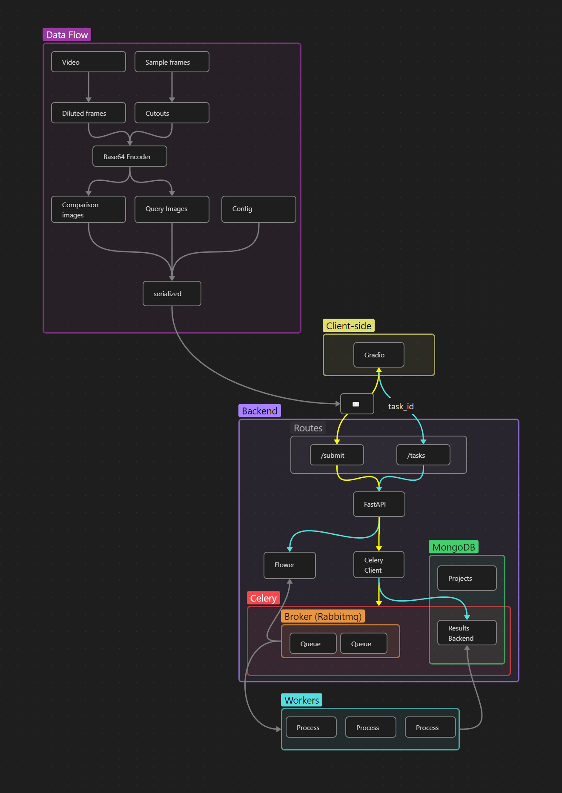

# video-to-image-dataset

Weakly supervised image retrieval from videos



## Installation
- Rename .env.example to .env
    ```
    $ mv .env.example .env
    ```
- Pull up the containers
    ```
    $ docker-compose up --build
    ```

## Usage
- The backend API documentation can be accessed at http://localhost:8020/docs
- The frontend can be accessed at http://localhost:8021
- Flower can be accessed at http://localhost:5555
